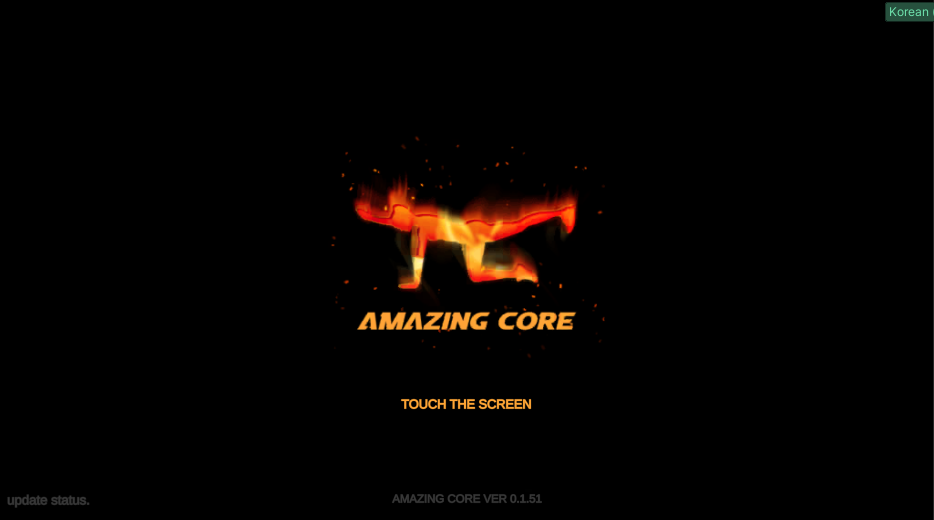
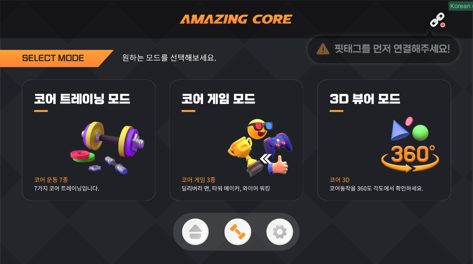
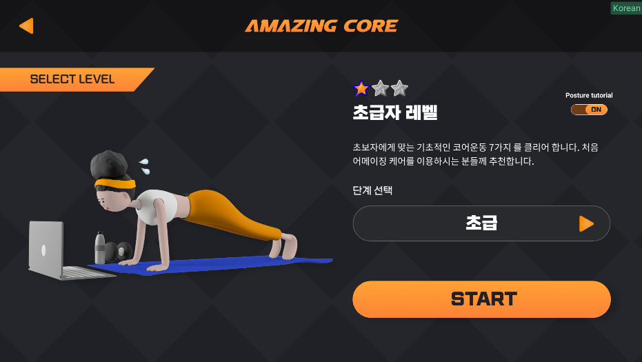
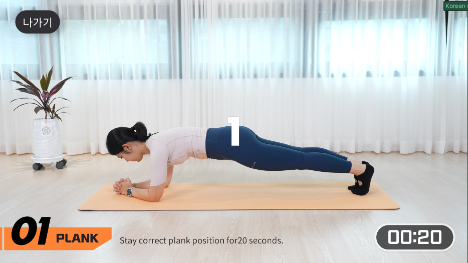
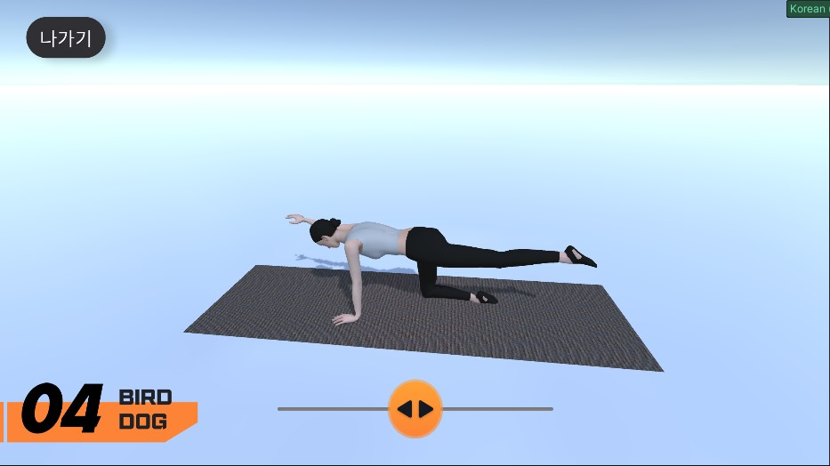
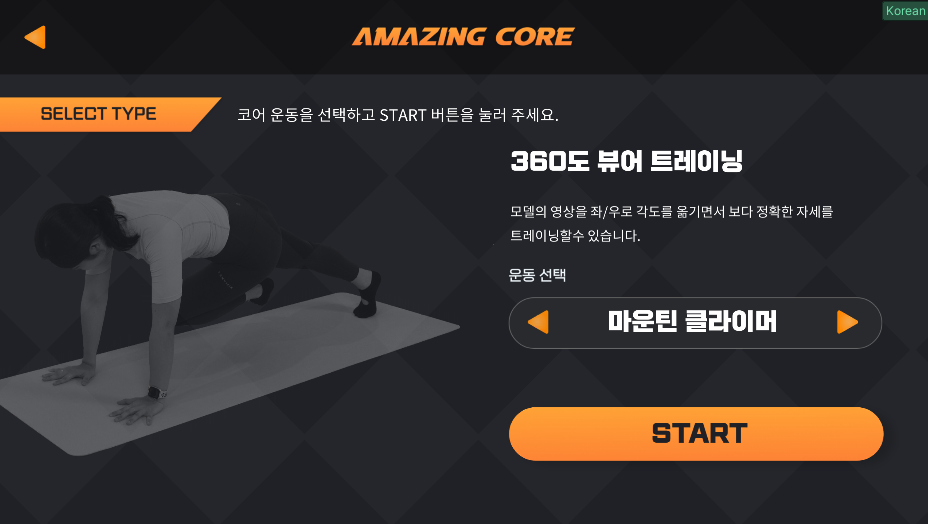
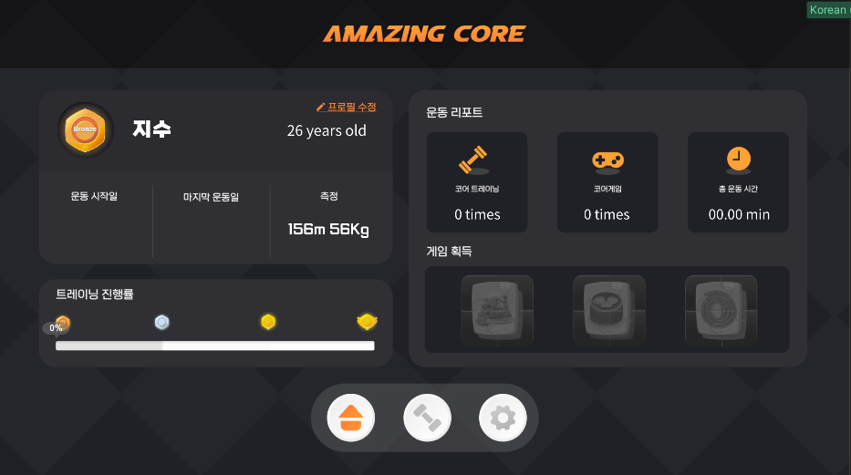
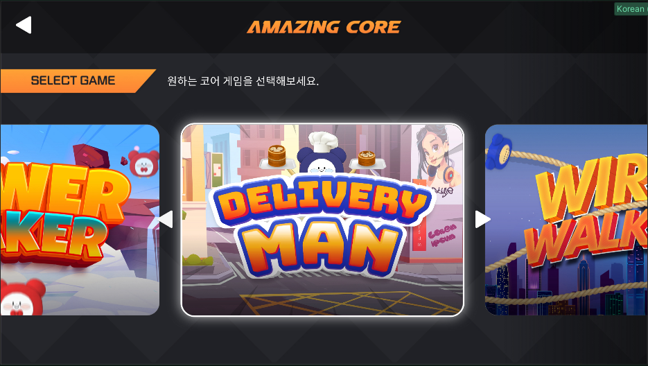
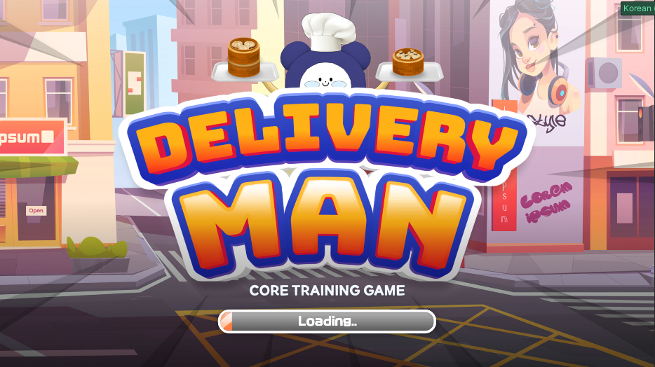
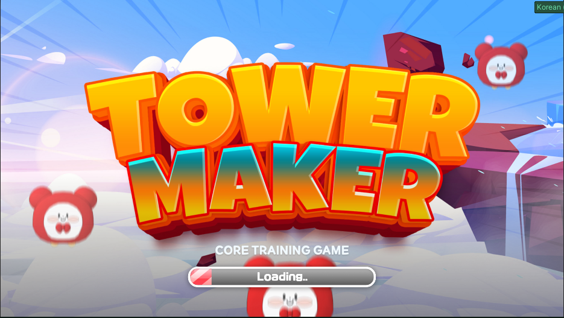

# 📘 보자마자 피트니스 - 어메이징 코어 (Amazing Core)

‘어메이징 코어’는 Unity 기반으로 제작된 **홈 피트니스 운동 콘텐츠 앱**입니다.
사용자가 BLE 센서를 착용하고 실제 코어 운동을 수행하면, 실시간 데이터에 따라 **트레이닝 모드**와 **게임 모드**가 동작합니다.

**게임 요소(Gamification)** 와 \*\*운동 루틴(Training System)\*\*을 결합하여 몰입도와 지속성을 높이는 것을 목표로 개발했습니다.

✨ **“어메이징 코어”는 게임처럼 재미있고, 콘텐츠처럼 꾸준히 운동할 수 있도록 만든 홈 피트니스 솔루션입니다.**
기획부터 설계·개발까지 전 과정에 참여하며 **실전 프로젝트 수준의 시스템 구축 경험**을 쌓았습니다.

## 📊 개발 개요

| 구분             | 내용                                                                                                                                                                                                                            |
| -------------- | ----------------------------------------------------------------------------------------------------------------------------------------------------------------------------------------------------------------------------- |
| **개발 기간 / 역할** | **2022.10 \~ 2023.03 (총 6개월)**<br>– **핵심 기능 개발 약 2개월** (트레이닝·게임·3D 뷰어 구축)<br>– **기능 확장/현지화/QA 약 4개월**<br>기획 1 · 디자인 1 · 개발 1 협업 중 **개발 총괄 100% 담당**                                                                           |
| **기술 스택**      | Unity3D (C#)<br>VideoPlayer · RenderTexture – 운동/튜토리얼 영상 재생<br>BLE (ESP32) – 코어 자세/움직임 인식<br>Unity UI + DOTween – 인터랙션 UI 구현<br>PlayerPrefs – 운동 이력/프로필 저장<br>Unity Localization – 한/영 다국어 지원<br>Cinemachine – 3D 뷰어 및 카메라 제어 |
| **주요 기여**      | 전체 UI/UX 설계 및 구현<br>트레이닝 루틴(7종 × 3단계) 시스템 개발<br>미니게임 콘텐츠 3종 직접 개발<br>3D 자세 뷰어 + Pinch/Zoom 제스처 개발<br>BLE 연동, 로컬 데이터 관리, 다국어 대응                                                                                                |

## 🎨 UI/UX 설계

* 메인 메뉴, 트레이닝, 게임, 튜토리얼, 결과 페이지 등 전체 화면 설계 및 구현
* DOTween으로 버튼 강조, 슬라이더 증가 등 자연스러운 인터랙션 적용
* PlayerPrefs 기반 **자동 로그인 및 운동 이력 유지** 기능

## 🧠 트레이닝 콘텐츠

* 난이도별 3단계 루틴(초급/중급/고급) 구성
* **영상 설명 → 튜토리얼 → 본 운동 → 결과 요약**의 흐름 구조
* `Training_AppManager.cs`에서 Coroutine 기반 전체 제어
* `Training_UIManager.cs`에서 타이머, 음성 카운트, 버튼 UI 담당

```csharp
public void StartTrainingRoutine()
{
    ShowDescriptionUI();
    PlayTutorialClip();
    PlayMainWorkout();
    ShowClearPopup();
}
```

## 🎮 게임 콘텐츠 (3종)

| 게임명              | 컨셉    | 핵심 로직                      |
| ---------------- | ----- | -------------------------- |
| **Tower Maker**  | 블록 쌓기 | 높이에 따른 카메라 위치 계산, 블록 Y축 이동 |
| **Delivery Man** | 중심 유지 | 좌우 기울기 판단, 도착 지점 도달 시 성공   |
| **Wire Walking** | 줄타기   | 일정 범위 이상 벗어나면 실패 처리        |

* `Game_UIManager.cs` : 타이머, 성공/실패 판정
* `Game_DataManager.cs` : 클리어 기록 저장 → 퍼즐 보상 해금

## 📦 3D 자세 뷰어

* 3D 모델을 프레임 단위로 나눠 순차 재생 (`MediaPlayer.cs`)
* `ExerciseDataSet.cs` ScriptableObject로 프리셋 관리
* Pinch/Zoom 제스처로 확대/회전 가능

```csharp
foreach (var frame in dataSet.objPerFrame)
{
    Instantiate(frame, parent);
}
```

## 🌍 현지화 & 시스템 연동

* Unity Localization으로 **한/영 전환 즉시 반영**
* BLE 센서 상태 확인 → 미연결 시 경고 메시지 및 버튼 비활성화


## ✅ 성과 요약

| 항목         | 내용                                      |
| ---------- | --------------------------------------- |
| **개발 기간**  | 총 6개월 (핵심 개발 2개월 + 기능 확장/QA 4개월)        |
| **기여도**    | 전체 기능 개발 100%                           |
| **트레이닝**   | 7종 × 3단계 루틴                             |
| **게임**     | Tower Maker, Delivery Man, Wire Walking |
| **BLE 연동** | 실시간 중심/자세 인식                            |
| **다국어 지원** | 한국어 / 영어                                |
| **UI 구현**  | 약 30개 화면 및 팝업                           |
| **특징**     | 실시간 운동 피드백, 반복 학습 루틴, 3D 자세 뷰어, 다국어 대응  |


## 🔁 전체 흐름도

```
▶ 로그인 → 모드 선택
   ├ 트레이닝 모드
   │   └ 설명 → 튜토리얼 → 본 운동 → Clear 팝업 → 데이터 저장
   ├ 게임 모드
   │   └ 게임 선택 → 진행 → 성공/실패 → 퍼즐 보상 획득
   └ 자세 뷰어 모드
       └ 프레임 기반 자세 재생, 확대/회전
▶ 프로필 관리 / 기록 확인 / 언어 전환
```

## 📸 게임 주요 화면

| 화면                    | 설명                                            | 이미지                            |
| --------------------- | --------------------------------------------- | ------------------------------ |
| **타이틀 화면**            | 앱 실행 시 첫 화면. 불꽃 연출과 로고 강조                     |      |
| **메인 모드 선택**          | 트레이닝, 게임, 3D 뷰어 모드 선택                         |      |
| **레벨 선택 화면**          | 초급/중급/고급 난이도 선택                               |      |
| **트레이닝 진행 화면**        | 운동 영상 기반 루틴 가이드                               |      |
| **운동 시연 (버드독)**       | Bird Dog 자세를 3D 모델로 확인                        |      |
| **3D 뷰어 모드**          | 운동 자세를 360도 회전·확대                             |        |
| **프로필/리포트 화면**        | 운동 기록, 뱃지, 누적 시간 확인                           |       |
| **게임 선택 화면**          | Tower Maker, Delivery Man, Wire Walking 3종 선택 |      |
| **게임 - Delivery Man** | 균형 유지 중심 게임. 좌우 움직임으로 성공/실패 판정                |  |
| **게임 - Tower Maker**  | 블록을 쌓으며 균형 유지                                 |     |


## 🎬 영상 및 스토어 링크

* [📺 유튜브 시연 영상](https://www.youtube.com/watch?v=Un5JtJjEnXU)
* [📲 Google Play 다운로드](https://play.google.com/store/apps/details?id=com.gateways.amazingcore&hl=ko-KR)

